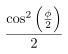
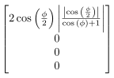
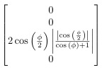
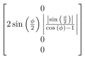
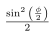
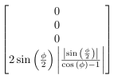
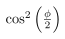
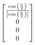
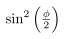
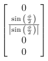

# Example output of measurement circuit report

- Final branches:

  * Measurement outcome: 00

    Classical bits results (clbit index: measured value): {0: 0, 1: 0}

    Probability:

    

    Statevector:

    

  * Measurement outcome: 01

    Classical bits results (clbit index: measured value): {0: 0, 1: 1}

    Probability:

    

    Statevector:

    

  * Measurement outcome: 10

    Classical bits results (clbit index: measured value): {0: 1, 1: 0}

    Probability:

    

    Statevector:

    

  * Measurement outcome: 11

    Classical bits results (clbit index: measured value): {0: 1, 1: 1}

    Probability:

    

    Statevector:

    

- Branches at 1st measure result:

  * Measurement outcome: 0

    Classical bits results (clbit index: measured value): {0: 0}

    Probability:

    

    Statevector:

    

  * Measurement outcome: 1

    Classical bits results (clbit index: measured value): {0: 1}

    Probability:

    

    Statevector:

    