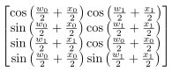

# symbolic-qiskit

[](https://codecov.io/gh/ianchung621/symbolic-qiskit)

[](https://github.com/ianchung621/symbolic-qiskit/actions/workflows/test.yml)
[](https://www.apache.org/licenses/LICENSE-2.0)


Symbolic simulator for [qiskit](https://github.com/Qiskit/qiskit) circuits using [sympy](https://github.com/sympy/sympy) backend, supporting mid-circuit measurement and state inspection.

## Table of contents
- [Installation](#installation)
- [Examples](#examples)
  - [Unitary mode](#unitary-mode)
  - [Measurement mode](#measurement-mode)
  - [TL;DR](#tldr)
- [Acknowledgment](#acknowledgment)

## Installation
```bash
pip install symbolic-qiskit
```
## Examples

We support two simulation modes, based on whether measurement occurs in the circuit:

- **Unitary mode**: pure statevector evolution

- **Measurement mode**: branching over measurement outcomes

### Unitary mode

Consider this circuit:

```python
from qiskit import QuantumCircuit
from qiskit.circuit import ParameterVector, Parameter

x = ParameterVector('x', length=2)
w = ParameterVector('w', length=2)

uqc = QuantumCircuit(2)
uqc.ry(x[0], 0)
uqc.ry(x[1], 1)
uqc.barrier(label = 'embedding')
uqc.ry(w[0], 0)
uqc.ry(w[1], 1)

uqc.draw('mpl', style='clifford')
```


We first create the `CircuitInspector` instance by:

```python
from symbolic_qiskit import CircuitInspector

inspector = CircuitInspector(uqc)
print(inspector)
```

output:
```text
<CircuitInspector mode=unitary, num_qubits=2, barrier_labels=['embedding'], chunks=[StandardGateChunk(layers=[StandardGateLayer(ops=[(ry, q=[0]), (ry, q=[1])])]), BarrierLayer(label = embedding), StandardGateChunk(layers=[StandardGateLayer(ops=[(ry, q=[0]), (ry, q=[1])])])]>
```

we can get the statevector (sympy Matrix) by barrier label:

```python
inspector.statevector(label='embedding')
```


Or get the final output state:

```python
inspector.statevector(label = None, simplify=True)
```


To extract the unitary matrix between any two barriers:

```python
inspector.unitary(label_end='embedding') # label_start/label_end is by default start/end of the circuit
```


This also works in **measurement mode** as long as there is no measurement between `label_start` and `label_end`:

### Measurement mode

Consider a circuit with mid-circuit measurement:

```python
phi = Parameter('phi')

mqc = QuantumCircuit(2, 2)
mqc.ry(phi, 0)
mqc.measure(0, 0)
mqc.barrier(label = '1st measure result')
mqc.h(1)
mqc.measure(1, 1)

mqc.draw('mpl', style='clifford')
```


After each measurement, each state ∣ϕ⟩ will project to 0 or 1 by projection operater P₀ or P₁, and the collapse states will be:

<div align="center">
    Pᵢ⎮ϕ⟩/∥Pᵢ∣ϕ⟩∥
</div>

Therefore, The simulator returns a list of **MeasurementBranch** objects, each representing a possible measurement outcome with properties:

- `measured_bits`: the qubit outcomes (e.g. (0, 1))
- `prob`: the symbolic probability of the outcome
- `state`: the post-measurement statevector
- `clbit_results`: classical bits values, a dict with key:value as clbit_index:clbit_value

In **measurement mode**, use `.branches` instead of `.statevector` to query the outcomes at given barrier:

```python
inspector = CircuitInspector(mqc)
branches = inspector.branches('1st measure result') # list[MeasurementBranch]

for b in branches:
    print(f'- qubit outcomes: {b.measured_bits}')
    print(f'  probability: {b.prob}')
    print(f'  state: {b.state}')
    print(f'  clbit_results: {b.clbit_results}')
```
Output:
```css
- qubit outcomes: (0,)
  probability: cos(phi/2)**2
  state: Matrix([[cos(phi/2)/Abs(cos(phi/2))], [0], [0], [0]])
  clbit_results: {0: 0}
- qubit outcomes: (1,)
  probability: sin(phi/2)**2
  state: Matrix([[0], [sin(phi/2)/Abs(sin(phi/2))], [0], [0]])
  clbit_results: {0: 1}
```


### TL;DR

Just use

```python
CircuitInspector(uqc).report()
```

It will report all the statevector/branches at all given barriers as well as final output statevector\branches.

\- Final statevector:


\- Statevector at embedding:


## Acknowledgment

Although this project takes a distinct approach using custom circuit chunking and symbolic evaluation to enable measurements, parts of this work are adapted from [qiskit-symb](https://github.com/SimoneGasperini/qiskit-symb) by [Simone Gasperini](https://github.com/SimoneGasperini), specifically:

- Symbolic matrix data of gates (e.g., `U`, `CX`)

- Test utilities for generating random parameterized qiskit circuits

We thank Simone for making `qiskit-symb` available under the Apache-2.0 license.